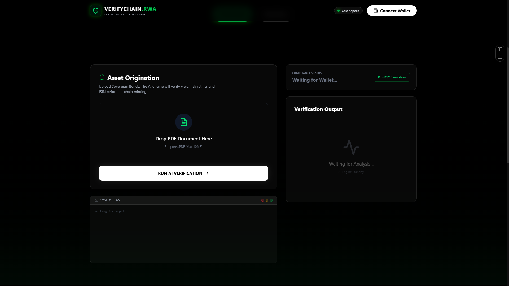

# 🏦 VerifyChain RWA
### East India Blockchain Summit 2.0

**VerifyChain RWA** is a decentralized Real World Asset (RWA) tokenization platform that brings transparency, security, and automation to bond trading. It leverages **AI Agents** to verify legal documents, **Oracles** for real-time market data, and **Smart Contracts** for compliance-enforced tokenization.

---

## 🚩 Problem Statement
Government bonds are widely regarded as safe, sovereign-backed investment instruments, yet meaningful retail participation remains limited. Structural inefficiencies and missing trust infrastructure prevent broader adoption, especially as tokenized government bonds emerge within the RWA ecosystem.

### Key Challenges:
- **High minimum investment thresholds**: Institutional barriers keep retail investors out.
- **Complex and fragmented onboarding**: Lengthy, paper-heavy processes.
- **Limited secondary market liquidity**: Bonds are hard to trade before maturity.
- **Opaque yield and payout visibility**: Investors lack real-time data on returns.
- **No standardized, tamper-proof verification**: Reliance on centralized intermediaries creates trust gaps.

---

## 💡 Proposed Solution: VerifyChain RWA
**Issuance already exists.** The missing piece is trust, verification, and compliance — that’s where **VerifyChain RWA** creates maximum value.

### What We Do:
- **AI-Powered Verification**: We use Llama 3 to analyze PDF bond certificates and extract critical financial data (ISIN, Face Value).
- **Real-Time Oracle**: We fetch live 10-year Treasury yields via Yahoo Finance API to ensure the bond's on-chain data reflects real-market conditions.
- **Proof of Reserve (PoR)**: We ensure that the amount of tokens minted cannot exceed the "Face Value" extracted from the legal document.
- **On-Chain Compliance**: Our smart contract enforces limits and tracks the asset lifecycle on the Celo blockchain.

---

## 🌍 Why Celo?
We chose **Celo** as our infrastructure layer for its unique "Mobile-First, Carbon-Negative" approach that aligns perfectly with our mission of accessible RWAs.

1.  **Mobile-First Accessibility**: Celo's lightweight protocol enables verification and trading on mobile devices, crucial for emerging markets.
2.  **Stablecoin-Native Gas**: Users can pay transaction fees in stablecoins (cUSD/USDC), removing the friction of holding volatile assets just for gas.
3.  **Sustainability**: Celo is carbon-negative, making our ESG-compliant bond platform truly green.
4.  **EVM Compatibility**: Allows us to leverage the robust Ethereum developer ecosystem while enjoying sub-cent fees.

---

## 🛠 Detailed Codebase Breakdown

### 1. Backend (`backend/app.py`)
The backend is a Flask server acting as the **Verification Oracle**. It bridges the off-chain world (documents, web data) with the on-chain world.

*   **`POST /analyze_and_oracle`**: This is the core endpoint.
    *   **Input**: Receives a PDF file (Bond Certificate).
    *   **Process - Step 1 (AI Analysis)**: Uses `PyPDF2` to read text. Sends the text to **Groq (Llama 3.3-70b-versatile)** with a prompt to extract JSON data: `bond_name`, `isin`, and `face_value_amount`.
    *   **Process - Step 2 (Market Oracle)**: Uses `yfinance` to fetch the ticker `^TNX` (CBOE 10-Year Treasury Note Yield) to get the real-time risk-free rate.
    *   **Output**: Returns a JSON object combining the AI-extracted metadata and the live market yield.

### 2. Smart Contract (`contracts/RealRWA.sol`)
The Solidity contract manages the asset lifecycle and enforces rules on the Celo blockchain.

*   **`createAsset(...)`**: Called by the owner to register a new bond. It records the Name, ISIN, Face Value (Hard Cap), Initial Yield, and IPFS Hash.
*   **`mintFractionalShares(...)`**: Allows minting tokens for a specific bond. **Critical Feature**: It checks `mintedAmount + amount <= faceValue`. This enforces **Proof of Reserve**—you cannot mint more tokens than the physical document allows.
*   **`updateMarketData(...)`**: Allows the oracle to update the yield of a bond, keeping it in sync with the real market.
*   **`BondMetadata` Struct**: Stores the truth of the asset: `name`, `isin`, `faceValue`, `currentYield`, `lastUpdate`, `ipfsHash`.

### 3. Frontend (`frontend/src/app/page.tsx`)
The user interface is a Modern Next.js application that orchestrates the flow.

*   **Document Upload**: Users upload a PDF.
*   **AI & Oracle Interaction**: Calls the backend `analyze_and_oracle` endpoint and displays the extracted "Confidence Score", Face Value, and Live Yield.
*   **Minting**: If the user approves the analysis, they sign a transaction using `ethers.js`. This calls `createAsset` on the smart contract, passing the AI-verified data directly to the blockchain.
*   **Dashboard**: Displays the "Public Transparency Ledger" by fetching all created bonds from the smart contract using `fetchRegistry`.

---

## 🚀 Live Demo & Links
- **Frontend Deployed URL**: [Click Here](https://verifychain-kappa.vercel.app/)
- **Backend API URL**: [Click Here](https://verifychain-rwa.onrender.com)
- **Smart Contract Address**: `0xC18243d1A4014A973B2206e3FC8FcCb65aaA0195` (Celo Sepolia Testnet)



---

##  Tech Stack

### **Frontend**
-   **Framework**: Next.js 16 (React 19)
-   **Styling**: Tailwind CSS v4, Framer Motion
-   **Blockchain Interaction**: Ethers.js v6
-   **Icons**: Lucide React

### **Backend**
-   **Framework**: Flask (Python)
-   **AI Model**: Llama 3.3 70B (via Groq API)
-   **Market Data**: Yahoo Finance (`yfinance`)
-   **PDF Processing**: PyPDF2
-   **web3.py**: Included for future server-side signing capabilities.

### **Smart Contracts**
-   **Language**: Solidity ^0.8.20
-   **Standard**: ERC-20 (OpenZeppelin)
-   **Network**: Celo (Sepolia Testnet)

---

## ⚡ Installation & Setup Guide

### 1️⃣ Clone the Repository
```bash
git clone https://github.com/Srizdebnath/verifychain-rwa
cd VerifyChain_RWA
```

### 2️⃣ Backend Setup (AI & Oracle Engine)
The backend handles document parsing, AI analysis, and market data fetching.

```bash
cd backend
python -m venv venv
# Activate Venv: source venv/bin/activate (Mac/Linux) or venv\Scripts\activate (Windows)
pip install -r requirements.txt
```

**Configure Environment Variables (`backend/.env`):**
```env
GROQ_API_KEY=your_groq_api_key
PRIVATE_KEY=your_wallet_private_key
```

**Run Server:**
```bash
python app.py
# Server running on http://localhost:5000
```

### 3️⃣ Frontend Setup (User Interface)
The frontend serves as the terminal for users to interact with the protocol.

```bash
cd ../frontend
npm install
```

**Configure Environment Variables (`frontend/.env.local`):**
```env
NEXT_PUBLIC_BACKEND_URL=http://localhost:5000
```

**Run Client:**
```bash
npm run dev
# App running on http://localhost:3000
```

---

## 🔌 API Endpoints

### `POST /analyze_and_oracle`
Uploads a Bond PDF, extracts data using AI, and fetches live yields.

-   **Body**: `form-data` with `file` (PDF)
-   **Response**:
    ```json
    {
      "ai_analysis": {
        "bond_name": "Government of India 7.26% 2033",
        "isin": "IN0020230018",
        "face_value_amount": 10000000
      },
      "oracle_data": {
        "source": "Yahoo Finance API",
        "ticker": "^TNX (10Y Yield)",
        "live_yield": 4.15,
        "timestamp": 171569234
      }
    }
    ```

---

## 🤝 Contribution
1.  Fork the repo
2.  Create your feature branch (`git checkout -b feature/amazing-feature`)
3.  Commit your changes (`git commit -m 'Add some amazing feature'`)
4.  Push to the branch (`git push origin feature/amazing-feature`)
5.  Open a Pull Request

---

### Built by Team **LowEnd Corp.**
